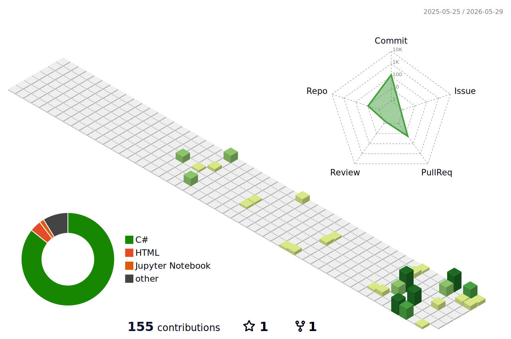

<h1 align="center">Hi 👋, I'm Mahmoud Ahmed</h1>

  Backend .NET Developer · Clean Architecture · RESTful APIs · Open to Work

  
  
  
  

---

## 🟢 Open to Backend Developer Roles (.NET)
> I'm actively seeking a backend position where I can contribute to scalable, well-architected systems and grow as a .NET engineer. Feel free to reach out!

---

## About Me

I'm a Computer Science graduate from the Faculty of Electronic Engineering, Menoufia University. I specialize in backend development with .NET, building RESTful APIs, applying Clean Architecture, and designing robust database systems. I care about writing maintainable, production-ready code and I'm always working to deepen my understanding of system design.

---

## 🔭 Currently Building

**[EduMind](https://github.com/Mahmoud921/YOUR_REPO)** — A Learning Management System (LMS) built with ASP.NET Core. Focused on clean architecture, role-based access, and real-world backend patterns.

---

## 🌱 Currently Learning

- System Design
- Angular
- Docker

---

## 🧠 Technical Skills

- **Backend:** ASP.NET Core, RESTful API Design, Clean Architecture
- **Database:** SQL Server, Database Design & Optimization
- **Tools:** Git, GitHub, Postman, Swagger, Docker
- **Languages:** C#, Python, C++

---

## 🛠 Tech Stack

  

  
  

---

## 📊 GitHub Stats

